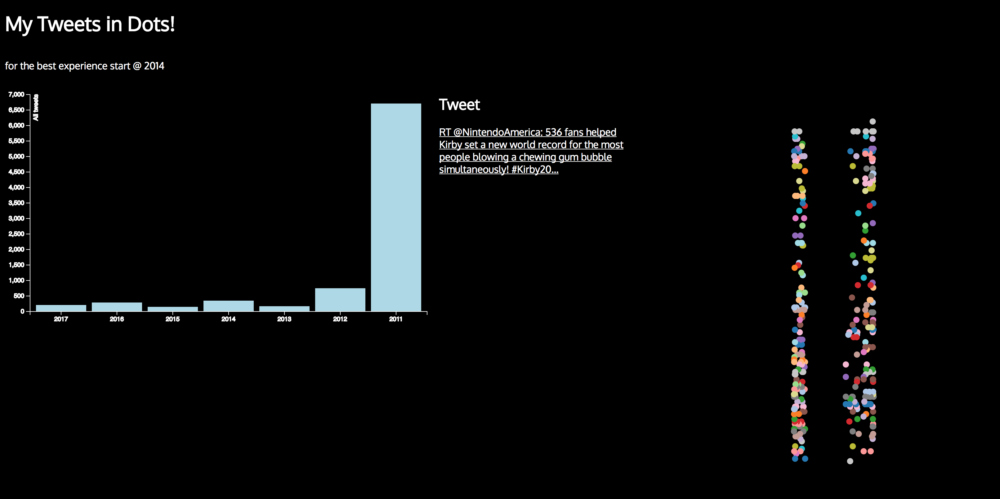

# Assessment 3

This is a assessment i needed to acquire data. And i thought it was a great idea to do my twitter data to make my last assessment more of a visualisation than cold numbers. i used the work of Mike bostock for the two charts i used. The [bar chart](https://bl.ocks.org/mbostock/3885304) and the [scatterplot](https://bl.ocks.org/mbostock/3887118).

*Disclaimer:* _Out of privacy reasons i deleted an @ user out of my data. The content is accessible but the tweets will send you to a unavailable tweet and the name will be in ------. To contain the privacy of that user._

## Background

This assessment is to work on the interaction of a chart. The data must interact on the other chart in the data visualisation. I used data from my own twitter wich everybody can download in the settings of your twitter profile. I wanted to create a visualisation instead of just two charts working together. I wanted to show that i'm kind of a twitter addict  🤷🏽‍♂️.

`profile > settings > archive > download your archive`

#### sample of my data layout

```csv
"tweet_id","in_reply_to_status_id","in_reply_to_user_id","timestamp","source","text","retweeted_status_id","retweeted_status_user_id","retweeted_status_timestamp","expanded_urls"
"918239532981669888","","","2017-10-11 22:18:59 +0000","<a href=""http://twitter.com/download/iphone"" rel=""nofollow"">Twitter for iPhone</a>","RT @JavaScriptKicks: The Complete HTML Cheat Sheet by codeburstio https://t.co/VLoqAPpTIZ #javascript #html via JavaScriptKicks","918238577066217472","2638950678","2017-10-11 22:15:11 +0000","https://javascriptkicks.com/r/189160?url=https://codeburst.io/the-complete-html-cheat-sheet-751fdae2480c?gi=65abb05eb51a,https://javascriptkicks.com/r/189160?url=https://codeburst.io/the-complete-html-cheat-sheet-751fdae2480c?gi=65abb05eb51a"
"916291183885905920","","","2017-10-06 13:16:56 +0000","<a href=""http://twitter.com/download/iphone"" rel=""nofollow"">Twitter for iPhone</a>","RT @SwiftOnSecurity: I installed Kaspersky on my computer and it detected the malware I was writing for the US government! https://t.co/Ye4…","916113919076388864","2436389418","2017-10-06 01:32:33 +0000","https://twitter.com/SwiftOnSecurity/status/916113919076388864/photo/1"
"915765817140269056","","","2017-10-05 02:29:19 +0000","<a href=""http://twitter.com/download/iphone"" rel=""nofollow"">Twitter for iPhone</a>","RT @wesbos: 🔥 Async functions can chain a .catch() to catch any errors without a try/catch https://t.co/O3ffEqvHc6","915610241907208192","815246","2017-10-04 16:11:07 +0000","https://twitter.com/wesbos/status/915610241907208192/photo/1,https://twitter.com/wesbos/status/915610241907208192/photo/1"
"915765732058779649","","","2017-10-05 02:28:59 +0000","<a href=""http://twitter.com/download/iphone"" rel=""nofollow"">Twitter for iPhone</a>","RT @iamdevloper: &gt; I'm too nervous to quit my job, what if freelancing doesn't work out?
*6 months into contracting*
&gt; imma be a few minute…","915510126991331328","564919357","2017-10-04 09:33:18 +0000","https://twitter.com/iamdevloper/status/915510126991331328/photo/1"
"915456640509513728","","","2017-10-04 06:00:46 +0000","<a href=""http://twitter.com/download/iphone"" rel=""nofollow"">Twitter for iPhone</a>","Today’s vibe:  https://t.co/clfvTtJVg3","","","","https://open.spotify.com/track/1vOZUvVZRrveuom1RLhBF0?si=aHpZfCdD"
```

### What did i do?

I wanted to do alot with this data but it was a hardship to get the visualisation what i originally wanted (sometimes, i'm a overachiever). 
So i created this datavisualisation that shows how many tweets i have on the screen and you can interact with that tweet, and even go to the original tweet. 




*	I started out working on my data to clean it and work this mess of a dataset. So i first rendered it as a text file and deleted what i didn't need and worked my way up from there [`d3.csvParseRows()`](https://github.com/d3/d3-dsv/blob/master/README.md#csvParseRows).

*	I used parts of the code from [bar chart](https://bl.ocks.org/mbostock/3885304)  by [Mike Bostock](https://github.com/mbostock). To rework it a little bit for the barchart.

*	Then I used parts of the code from [scatterplot](https://bl.ocks.org/mbostock/3887118) by [Mike Bostock](https://github.com/mbostock). To rework it a little bit for the barchart.

*	I started out to clean the data a bit more after I knew what I wanted to do, so that it is readable.To Achieve that i made a function to map all my data and nested the data for the barchart. [`d3.nest()`](https://github.com/d3/d3-collection/blob/master/README.md#nests)

*	Then I made the data fit i used the data from 2011 - 2017 to delete the data that I didn't need. I already refactored the v3 to v4 and made variables dynamic so i could just paste it and fix the little parts. I used the `substring()` function to achieve this. Put the header (data on top you want to remove) and the footer(data below you want to remove) and it will keep the data in between these variables.

*	 I created a `update()` function for every click on the bar you want to look into and you see the circles will appear. Then i created in d3 a listener on the scatterplot so you can click on every dot to see what tweet hides behind it. I made this completely with d3. You click on the bar and draw the scatterplot.

```js
  function update(data) {
    var fixedData = data.values;

    var selection = dotted.selectAll('.dot')
        .data(fixedData);

    selection.enter()
      .append('circle')
        .attr('class', 'dot')
        .attr('r', 5)
        .attr('cx', function(d) { 
         return xScatter(d.usedate); 
        })
        .attr('cy', function(d) { 
          return yScatter(d.characters); 
      })
        .style('fill', function(d) { 
          return color(d.characters); 
        })
        .on('click', function (d) {
          return d3.select('.showTweet')
          .select('a')
          .attr('href', 'https://twitter.com/_Vintelligent/status/'+ d.tweetId)
          .text(d.content);
          update();
        });
```

When you click on a other year it will delete the amount what he doesn't need and update the content. So you wouldn't have to redraw every circle (which saves alot of time).

* I had to rework my code and data multiple times to make this work as I wanted. This way had a few hiccups in this road. As an example I had to make two maps to make the scatterplot work. This could probably be resolved by making it more focused on the bar chart. I have two mapped functions because the data.

*	After that mostly styled my charts in Javascript (especially the scatterplot, i used the [`d3.schemeCategory20`](https://github.com/d3/d3-scale/blob/master/README.md#schemeCategory20)). And the background and well everything else in CSS

### Features

[**d3 API**](https://github.com/d3/d3/blob/master/API.md)
* [`d3.axisBottom() and d3.axisLeft()`](https://github.com/d3/d3-axis/blob/master/README.md)
* [`d3.scaleOrdinal()`](https://github.com/d3/d3-3.x-api-reference/blob/master/Ordinal-Scales.md#ordinal)
* [`d3.extent()`](https://github.com/d3/d3-array/blob/master/README.md#extent)
* [`d3.scaleLinear()`](https://github.com/d3/d3-scale/blob/master/README.md#scaleLinear)
* [`d3.enter()`](https://github.com/d3/d3-selection/blob/master/README.md#selection_enter)
* [`d3.csvParseRows()`](https://github.com/d3/d3-dsv/blob/master/README.md#csvParseRows)
* [`d3.text()`](https://github.com/d3/d3-request/blob/master/README.md#text)
* [`d3.exit()`](https://github.com/d3/d3-selection/blob/master/README.md#selection_exit)
*	[`d3.nest()`](https://github.com/d3/d3-collection/blob/master/README.md#nests)
*	[`d3.remove()`](https://github.com/d3/d3-transition/blob/master/README.md#transition_remove)
* [`d3.timeparse()`](https://github.com/d3/d3-time-format/blob/master/README.md#timeParse)
* [`d3.schemeCategory20`](https://github.com/d3/d3-scale/blob/master/README.md#schemeCategory20)

### License

Check the work of: 
* [Mike Bostock](https://github.com/mbostock)

The work i based this on:  [bar chart](https://bl.ocks.org/mbostock/3885304) & [scatterplot](https://bl.ocks.org/mbostock/3887118) by [Mike Bostock](https://github.com/mbostock) [GPLv3](https://opensource.org/licenses/GPL-3.0).


[GPLv3](https://choosealicense.com/licenses/gpl-3.0/) -  [Vincent Kempers 👨🏽‍💻](https://twitter.com/_Vintelligent)
